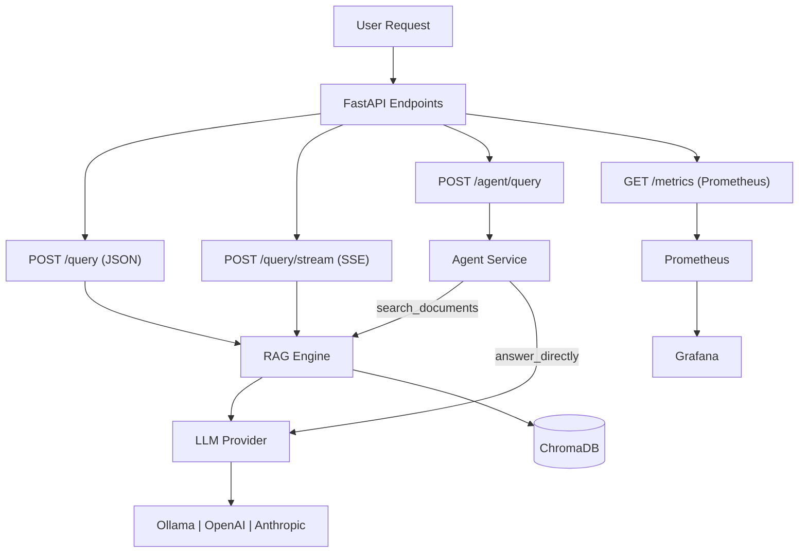

# LocalRAG

Offline-first RAG system. Your documents, your models, your machine.

## What It Is

LocalRAG ingests your local documents, stores embeddings in a local ChromaDB database,
and answers questions using Ollama (or OpenAI / Anthropic) models. No cloud required by default.

### Technical Decisions, In Plain English

If you're new to RAG, this section explains the key design choices and what they mean in practice.

- **Local-first by default:** the happy path runs fully on your machine (`Ollama` + local `ChromaDB`). That means privacy, no mandatory API bills, and easier offline development.
- **Layered API design:** routes are intentionally thin, business logic sits in services, and storage access is behind repository/vector-store adapters. In practice, this keeps changes safer and easier to test.
- **ChromaDB as the vector store:** we chose it because it runs embedded with disk persistence and no separate server setup. Good for laptop workflows, and swappable later via `localrag/storage/vector_store.py`.
- **`nomic-embed-text` as default embeddings:** it gives a strong quality/speed balance for local machines. You can switch models, but rebuilding collections is the expected tradeoff.
- **Structural chunking over blind slicing:** we chunk by meaningful boundaries (headings, tables, code blocks) instead of fixed windows, so retrieval sends complete facts instead of broken fragments.
- **Hybrid retrieval (meaning + exact text):** vector search handles semantic similarity, BM25 handles exact tokens (error codes, SKUs, version strings), and the retriever fuses both so each covers the other's blind spots.
- **Freshness-aware ranking:** newer chunks are favored when content competes on relevance, reducing the common "correct-but-old policy" failure mode.
- **Provider abstraction, not lock-in:** the LLM layer is behind a provider interface (`ollama`, `openai`, `anthropic`), so changing model vendors is mostly configuration and limited wiring.
- **Agent mode is explicit and bounded:** the agent endpoint uses a small tool set (`search_documents` or `answer_directly`) instead of a complex autonomous loop, keeping behavior understandable and debuggable.
- **Evaluation is part of the product, not an afterthought:** there is a bundled eval dataset and repeatable RAGAS run path, so retrieval quality can be measured instead of guessed.

## Architecture



## 5-Minute Quickstart (uv + local Ollama)

1. **Install Ollama** — [ollama.com/download](https://ollama.com/download). See [docs/ollama.md](docs/ollama.md).

2. **Install dependencies:**

```bash
uv sync
```

3. **Start Ollama and pull models:**

```bash
ollama serve
ollama pull nomic-embed-text
ollama pull llama3.2
```

4. **Copy the example env file:**

```bash
cp .env.example .env
```

5. **Ingest documents and query:**

```bash
uv run localrag ingest ./docs
uv run localrag query "What are the key topics in these documents?"
```

That's it — no cloud API keys needed for local Ollama mode.

## API

Start the API server:

```bash
uv run uvicorn localrag.api.main:app --reload
```

Open `http://127.0.0.1:8000/docs` for interactive API docs.

### Endpoints

| Method | Path | Description |
| --- | --- | --- |
| `GET` | `/health` | Readiness check (Ollama + ChromaDB) |
| `POST` | `/ingest` | Ingest a single file |
| `POST` | `/ingest/directory` | Ingest a directory recursively |
| `POST` | `/query` | JSON answer with sources and latency |
| `POST` | `/query/stream` | SSE token stream |
| `POST` | `/agent/query` | Agentic RAG (Anthropic tool-use) |
| `GET` | `/metrics` | Prometheus metrics |
| `GET` | `/collections` | List Chroma collections |
| `DELETE` | `/collections/{name}` | Delete a collection |
| `POST` | `/collections/rebuild` | Re-embed all stored sources |

All endpoints except `/health` and `/metrics` require `X-API-Key` when `API_KEY` is set in `.env`.

## Configuration

Copy `.env.example` to `.env` and adjust values:

```bash
cp .env.example .env
```

Key settings:

| Variable | Default | Description |
| --- | --- | --- |
| `API_KEY` | _(empty)_ | Require `X-API-Key` header (leave empty to disable auth) |
| `LLM_BACKEND` | `ollama` | LLM provider: `ollama`, `openai`, or `anthropic` |
| `OLLAMA_BASE_URL` | `http://localhost:11434` | Ollama server URL |
| `OLLAMA_EMBED_MODEL` | `nomic-embed-text` | Embedding model |
| `OLLAMA_LLM_MODEL` | `llama3.2` | Chat model for Ollama backend |
| `OPENAI_API_KEY` | _(empty)_ | OpenAI key (required for `openai` backend) |
| `OPENAI_MODEL` | `gpt-4o-mini` | OpenAI model tag |
| `ANTHROPIC_API_KEY` | _(empty)_ | Anthropic key (required for `anthropic` backend or agent) |
| `ANTHROPIC_MODEL` | `claude-haiku-4-5` | Anthropic model tag |
| `CHROMA_PERSIST_PATH` | `./data/chroma` | Where ChromaDB stores vectors |
| `CHROMA_COLLECTION_NAME` | `localrag` | ChromaDB collection name |
| `CHUNKING_MODE` | `structural` | Ingestion chunking mode: `structural` or `fixed` |
| `CHUNK_MAX_CHARS` | `1200` | Max chunk size budget for structural chunking |
| `CHUNK_MIN_CHARS` | `200` | Small-chunk merge floor for structural chunking |
| `RAG_TOP_K` | `5` | Chunks retrieved per query |
| `RETRIEVAL_MODE` | `hybrid` | Retrieval mode: `hybrid` (vector + BM25) or `vector` |
| `BM25_WEIGHT` | `0.5` | Weight for BM25 when non-default weighted fusion is used |
| `RRF_K` | `60` | Reciprocal rank fusion smoothing constant |
| `FRESHNESS_HALF_LIFE_DAYS` | `30.0` | Recency decay half-life; set `0` to disable |
| `LOG_LEVEL` | `INFO` | Logging level (JSON in production, colored in TTY) |

## CLI

```bash
uv run localrag --help

# Ingest
uv run localrag ingest ./docs
uv run localrag ingest-dir ./docs --recursive

# Query
uv run localrag query "How does chunking work?"

# Eval
uv run localrag eval --offline

# Collections
uv run localrag collections list
uv run localrag collections rebuild
```

## Docker (full stack)

```bash
docker compose up --build
```

Starts: `localrag-api`, `ollama`, `chromadb`, `prometheus`, `grafana`.

Pull models in the Ollama container after startup:

```bash
docker exec -it <ollama_container_name> ollama pull nomic-embed-text
docker exec -it <ollama_container_name> ollama pull llama3.2
```

Then open:
- API: `http://localhost:8000/docs`
- Grafana: `http://localhost:3000` (admin / admin)
- Prometheus: `http://localhost:9090`

## Evals (RAGAS)

Run the offline evaluation suite against the bundled dataset:

```bash
uv run localrag eval --offline
```

Results are written to `evals/results/`. The nightly GitHub Actions workflow (`.github/workflows/evals.yml`) also runs evals automatically.

### Benchmark (offline baseline)

The eval dataset (`evals/dataset.json`) contains 20 balanced Q/A/context triplets covering in-scope and out-of-scope cases. Baseline metrics on the bundled dataset:

| Metric | Target |
| --- | --- |
| faithfulness | ≥ 0.7 |
| answer_relevancy | ≥ 0.7 |
| context_precision | ≥ 0.6 |
| context_recall | ≥ 0.6 |

Run `uv run localrag eval --offline` to get current numbers.

## Retrieval design notes

LocalRAG now defaults to structural chunking, hybrid vector+BM25 retrieval, and
freshness-aware reranking. The details (including ranking math and settings)
live in [docs/rag-retrieval.md](docs/rag-retrieval.md).

## Kubernetes (k3s)

Apply the manifests under `k8s/`:

```bash
kubectl apply -f k8s/configmap.yaml
kubectl apply -f k8s/secret.yaml
kubectl apply -f k8s/deployment.yaml
kubectl apply -f k8s/service.yaml
kubectl apply -f k8s/hpa.yaml
```

Edit `k8s/secret.yaml` to add your actual API keys before applying.

## Development

```bash
uv sync
uv run pytest
uv run ruff check .
uv run ruff format .
uv run mypy localrag/ --ignore-missing-imports --no-strict-optional
```

Install pre-commit hooks:

```bash
uv run pre-commit install
```

See [docs/agent-navigation.md](docs/agent-navigation.md) for codebase navigation and [docs/architecture.md](docs/architecture.md) for the full architecture description.

## Documentation

- [docs/ollama.md](docs/ollama.md) — Installing Ollama
- [docs/architecture.md](docs/architecture.md) — Architecture deep-dive
- [docs/agent-navigation.md](docs/agent-navigation.md) — Fast codebase orientation for agents
- [docs/rag-retrieval.md](docs/rag-retrieval.md) — Retrieval ranking and chunking details
- [docs/issues-and-fixes-reddit-rag.md](docs/issues-and-fixes-reddit-rag.md) — Reddit thread issues mapped to LocalRAG fixes
- [docs/adr/](docs/adr/) — Architecture Decision Records
