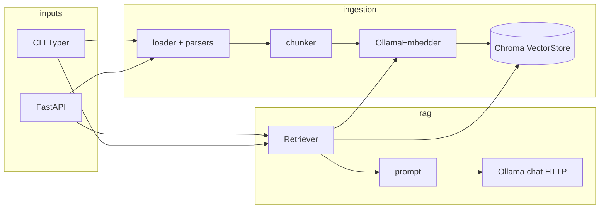

# Architecture

LocalRAG is a small, layered Python package. Most features touch one layer; cross-cutting behavior lives in `localrag/settings.py`, `localrag/logging_config.py`, and `localrag/api/dependencies.py`, with HTTP lifecycle and middleware in `localrag/api/main.py`.

The **HTTP API** uses a basic DDD-style split: **schemas** (`localrag/api/schemas.py`) hold request/response OpenAPI models only; **application services** (`localrag/api/service.py`) implement use cases (health, ingest HTTP rules, query SSE mapping, collection operations); **repositories** (`localrag/api/repository.py`) isolate persistence used by those services (Chroma collections wrapping `VectorStore`); **routers** (`localrag/api/routers/*.py`) stay thin adapters. `HttpMappedError` subclasses (`IngestApiError`, `RagApiError`) and the handler in `main.py` translate validation and RAG failures to HTTP without putting that logic in routers.

## Data flow

- **Ingest:** files → `loader` / `ingestion/parsers/*` → text → `chunker` → `OllamaEmbedder` → `VectorStore` (Chroma, persistent path from settings). The **HTTP** ingest flow runs path decode, existence checks, and `INGEST_ROOTS` in `localrag/api/service.py` (`ingest_file` / `ingest_directory`), then calls `IngestionService`; optional per-request `embed_model` overrides `OLLAMA_EMBED_MODEL`. Failures raise `IngestApiError` → JSON in `main.py`. CLI ingests call `IngestionService` directly.
- **Rebuild:** `POST /collections/rebuild` and `localrag collections rebuild` list distinct `source` values in the active collection, drop vectors for missing files, and re-chunk/re-embed remaining paths (optional `embed_model` override). Implemented in `IngestionService.rebuild_collection`.
- **Query:** question → `Retriever` (embed query, query Chroma) → `build_prompt` → Ollama **`POST /api/chat`** (streaming in API/CLI as implemented). The **HTTP** route runs retrieval synchronously (`get_query_contexts` in `localrag/api/service.py`) so embedding/Chroma errors return proper status codes before SSE starts, then maps chat tokens via `iter_query_sse_events`.

## Package map

| Area | Path | Role |
| --- | --- | --- |
| Settings | `localrag/settings.py` | `Settings` + `get_settings()`; env vars from `.env` (includes `log_level`) |
| Logging | `localrag/logging_config.py`, `localrag/api/middleware.py` | `configure_logging()`, stderr handler on `localrag.*`, `X-Request-ID` on HTTP requests |
| API wiring | `localrag/api/dependencies.py` | Cached factories: vector store, embedder, retriever, RAG engine, ingestion service, `ChromaCollectionRepository` |
| HTTP API (transport) | `localrag/api/main.py`, `localrag/api/routers/*` | Lifespan (`configure_logging`), `RequestContextMiddleware` (`X-Request-ID`), global exception + validation handlers + `HttpMappedError`; thin route handlers |
| HTTP API (contracts) | `localrag/api/schemas.py` | Pydantic request/response models and path aliases (OpenAPI) |
| HTTP API (use cases) | `localrag/api/service.py` | Health check, ingest HTTP rules, query contexts + SSE events, collection list/delete/rebuild orchestration |
| HTTP API (persistence) | `localrag/api/repository.py` | `ChromaCollectionRepository` → `VectorStore` for collection list/delete and health’s collection list |
| CLI | `localrag/cli/app.py`, `localrag/cli/commands/*` | `localrag` Typer entry (`pyproject` `[project.scripts]`) |
| Ingestion orchestration | `localrag/ingestion/service.py` | `IngestionService`: paths → parse → chunk → embed → upsert |
| File formats | `localrag/ingestion/parsers/*` | pdf, docx, markdown, text, code |
| Chunking / embed | `localrag/ingestion/chunker.py`, `localrag/ingestion/embedder.py` | Local text splits; Ollama **`POST /api/embed`** (see `localrag/ollama/schemas.py`) |
| Storage | `localrag/storage/vector_store.py` | Chroma client wrapper |
| RAG | `localrag/rag/retriever.py`, `engine.py`, `prompt.py` | Retrieve top-k, build prompt, call LLM |
| Ollama API models | `localrag/ollama/schemas.py` | Pydantic types + `parse_ollama_json` / `parse_ollama_json_line` for outbound requests and responses |

## Extension points

- **New file type:** add a parser under `localrag/ingestion/parsers/`, register it via `loader` / parser dispatch (see `localrag/ingestion/loader.py`).
- **New HTTP surface:** add schemas in `localrag/api/schemas.py`, application logic in `localrag/api/service.py`, persistence in `localrag/api/repository.py` (if new storage access), thin router in `localrag/api/routers/`, wire DI in `localrag/api/dependencies.py`, include the router in `localrag/api/main.py`.
- **New CLI command:** new module under `localrag/cli/commands/`, register in `localrag/cli/app.py`.
- **New config:** field on `Settings` in `localrag/settings.py`, document in `.env.example`, use via `get_settings()`.
- **Stricter HTTP ingest policy:** adjust checks in `localrag/api/service.py` (`ingest_file` / `ingest_directory`) and/or `is_path_allowed` in `localrag/settings.py`.

## Tests

Tests live under `tests/` (`conftest.py` sets a quiet default `LOG_LEVEL` for pytest). Many cases use stubs or HTTP mocks (e.g. Ollama via respx); run with `uv run pytest`.
