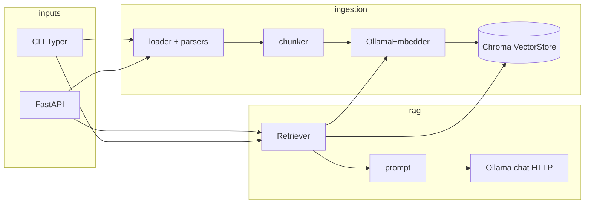

# Architecture

Hermit is a small, layered Python package. Most features touch one layer; cross-cutting behavior lives in `hermit/config.py` and `hermit/api/dependencies.py`.

## Data flow

- **Ingest:** files → `loader` / `ingestion/parsers/*` → text → `chunker` → `OllamaEmbedder` → `VectorStore` (Chroma, persistent path from settings).
- **Query:** question → `Retriever` (embed query, query Chroma) → `build_prompt` → Ollama generate API (streaming in API/CLI as implemented).

## Package map

| Area | Path | Role |
| --- | --- | --- |
| Settings | `hermit/config.py` | `Settings` + `get_settings()`; env vars from `.env` |
| API wiring | `hermit/api/dependencies.py` | Cached factories: vector store, embedder, retriever, RAG engine, ingestion service |
| HTTP API | `hermit/api/main.py`, `hermit/api/routers/*` | Routes: health, ingest, query, collections |
| CLI | `hermit/cli/app.py`, `hermit/cli/commands/*` | `hermit` Typer entry (`pyproject` `[project.scripts]`) |
| Ingestion orchestration | `hermit/ingestion/service.py` | `IngestionService`: paths → parse → chunk → embed → upsert |
| File formats | `hermit/ingestion/parsers/*` | pdf, docx, markdown, text, code |
| Chunking / embed | `hermit/ingestion/chunker.py`, `hermit/ingestion/embedder.py` | Local text splits; Ollama embedding API |
| Storage | `hermit/storage/vector_store.py` | Chroma client wrapper |
| RAG | `hermit/rag/retriever.py`, `engine.py`, `prompt.py` | Retrieve top-k, build prompt, call LLM |

## Extension points

- **New file type:** add a parser under `hermit/ingestion/parsers/`, register it via `loader` / parser dispatch (see `hermit/ingestion/loader.py`).
- **New HTTP surface:** new router in `hermit/api/routers/`, include it in `hermit/api/main.py`.
- **New CLI command:** new module under `hermit/cli/commands/`, register in `hermit/cli/app.py`.
- **New config:** field on `Settings` in `hermit/config.py`, document in `.env.example`, use via `get_settings()`.

## Tests

Integration-style tests live under `tests/`; they exercise CLI/API/ingestion paths against the real stack where practical. Run with `uv run pytest`.
